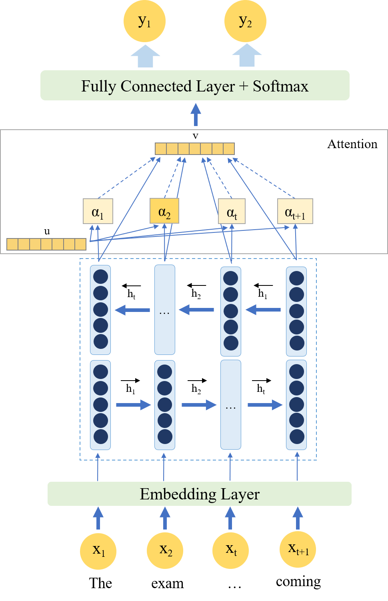
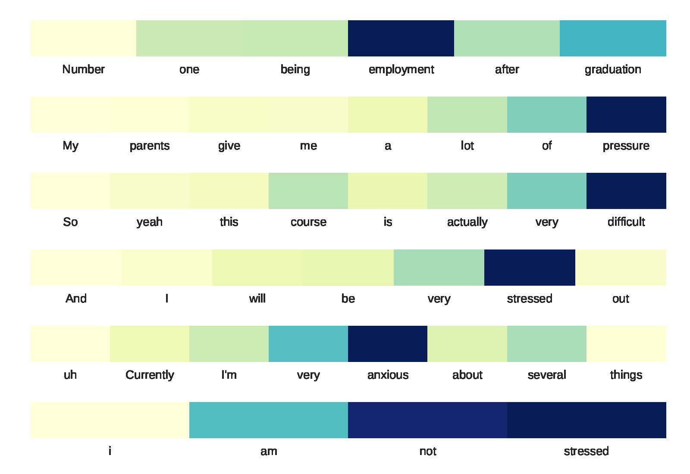

# LSTM with Attention by using Context Vector for Classification task

The implementation of <a href="https://arxiv.org/abs/1805.12307">Attention-Based LSTM for Psychological Stress Detection from Spoken Language Using Distant Supervision</a> paper. The idea is to consider the importance of every word from the inputs and use it in the classification. Then the importance scores are normalized through the softmax layer. The weighted sum of the score and hidden states in every time-step is used for the classification.

If you are using the code or data in your work, please cite the following (ICASSP 2018 Proceeding)
```
@INPROCEEDINGS{8461990,
author={G. I. Winata and O. P. Kampman and P. Fung},
booktitle={2018 IEEE International Conference on Acoustics, Speech and Signal Processing (ICASSP)},
title={Attention-Based LSTM for Psychological Stress Detection from Spoken Language Using Distant Supervision},
year={2018},
volume={},
number={},
pages={6204-6208},
doi={10.1109/ICASSP.2018.8461990},
ISSN={2379-190X},
month={April},}
```

### Data
Please find stress datasets in the ```data/``` directory.
The interview dataset is saved in the ```csv``` format and the tweet dataset are stored in the ```npy``` format.

### Architecture

The architecture of the model is illustrated by the following



You can easily get the attention weights from the model and visualize them


